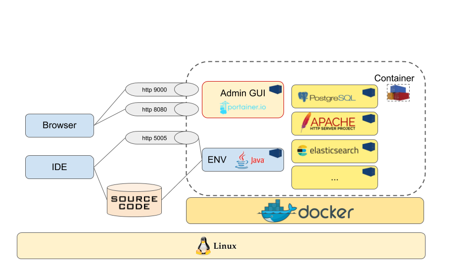

Vous recherchez un environnement de développement sous Docker ?

J'ai développé un environnement qui va vous simplifier la vie.

Je vous le partage dans cet article : 

## Présentation

A l'aide d'un ensemble de scripts sh, vous pouvez rapidement obtenir un environnement de développement fonctionnel et efficace. Ce-dernier vous permettra principalement de développer en langage Java.

J'utilise cet environnement de développement depuis des mois sur plusieurs postes de développement et sur plusieurs projets.

Voici un schéma du principe de son fonctionnement

Sous un poste Linux, à l’aide de mes scripts et de Docker, vous allez générer un ensemble de container Docker:

Le container principal Java est celui qui vous permettra d’exécuter votre application Java en cours de développement. L’image Docker à l’origine du container n’est pas une image “légère” destinée à fonctionner en production dans les nuages :-) . En effet, cette image dispose des outils / éléments nécessaires au développement:

- Java 8, 11, ...
- Maven,
- Outils réseaux,
- Historique des commandes, 
- Utilisateur applicatif,

Les autres containers sont là pour bénéficier d’un parc de container, vous permettant d’agrémenter votre application de ses dépendances applicatives. Par exemple, si votre application a besoin d’une base de données, d’un moteur d’indexation (Elasticsearch) , d’une authentification OIDC, … vous trouverez quelques scripts, vous permettant de disposer de ces éléments.

## Développement

Le code source est partagé entre le système hôte et le container principal Java. Vous n’aurez donc aucun mal à modifier ce code depuis votre système hôte pour qu’il soit pris en compte directement par votre container principal Java. Le partage est effectué par un volume Docker.

Si l’application développée est une application Web, vous pourrez la tester depuis les navigateur de votre système hôte. J’utilise le port 8080.

Vous pourrez débugger en mode remote sur le port 5005. C’est sans doute une contrainte pour certains. Personnellement, j’ai souvent du mal à exécuter Liferay directement dans Eclipse. Je trouve qu’il est plus léger d'exécuter les applications à l’extérieur de l’IDE.

## Analyse de code 

L'environnement comprend également deux images Sonar:

- une image pour avoir un serveur SonarQube rapidement,
- une image pour lancer un sonar runner à la demande pour analyser facilement votre code source.

## Tester une architecture 

Au delà des développements, cet environnement me permet aussi de tester facilement une architecture applicative. Pour exemple, récemment, j'ai reproduis l'environnement d'un client pour vérifier le bon fonctionnement d'une authentification OIDC. L'environnement comprenait les éléments suivants : Apache, Liferay, Keycloak, deux bases Postgres, Elasticsearch.

Chaque logiciel étant dans un container différent, j'ai reproduis un mini architecture avec un logiciel par machine (container).

## Wordpress

Lorsque vous parcourez les différents scripts, vous verrez aussi que certains permettent de lancer un Wordpress. J'y ai ajouté cette possibilité afin de développer un site internet (je développe actuellement le site internet de mon épouse). Le comportement de l’environnement est dans ce cas le même que pour Java. Il faut remplacer le conteneur principal Java par le container Wordpress.

## Ionic

Toujours sur le même principe, à côté des images Java et Wordpress, vous trouverez une image Ionic. Le but de cette image est d’avoir un un environnement de développement Ionic clé en main et ainsi avoir la possibilité de développer des applications mobiles. Ceci dans le but de faciliter les développements mobiles. Cette image n’est pour le moment pas encore fonctionnelle. Il me reste encore du travail :-)

## Test et Modestie :-)

Je vous invite à cloner mon repository git et à tester l'environnement. Ne vous inquiétez pas si le premier lancement est un peu plus long car Docker doit compiler l'environnement.

Il est disponible dès à présent à cette adresse : https://github.com/ThierryTouin/docker-dev-station

Je suis preneur de vos retours, remarques, partages : n'hésitez pas ! 

Je l’utilise tous les jours, je compte sur votre indulgence si certains scripts ne fonctionnent pas tout à fait comme prévu. Mais, je vous fais confiance : entre développeur, vous comprendrez certainement ce que je veux dire ;-)
