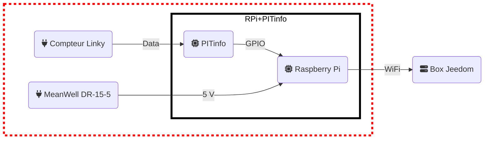
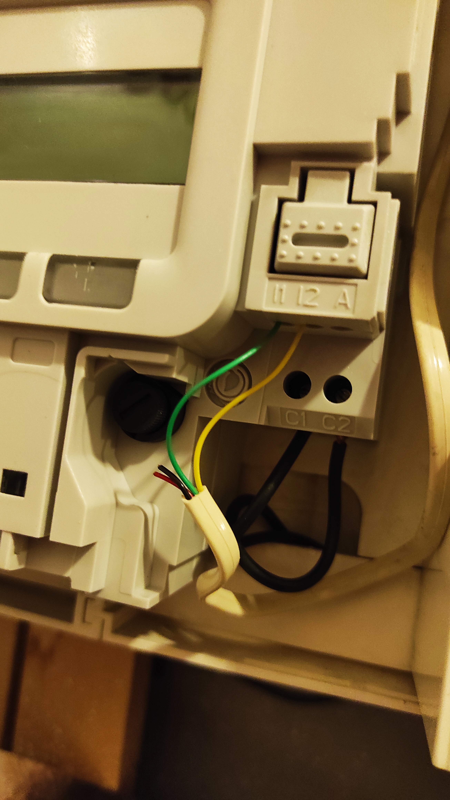
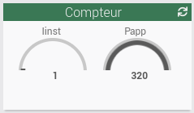
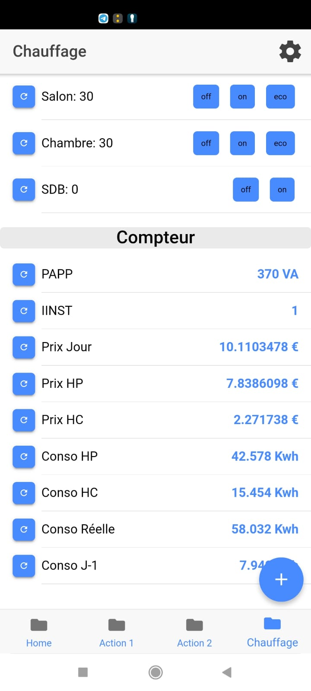

# /!\ Article en construction

Salut à tous!

Je voulais partager avec vous mon projet de suivi de ma consommation électrique en temps réel. 
Les données récupérées sont donc les données de consommation électrique en sortie du compteur Linky.
Pour faire cela, je devais pouvoir 
- Lire les données de consommation sur le bornier du Linky
- Extraire les informations intéressantes de ces données
- Transmettre les informations extraites vers ma box Jeedom
- Afficher ces données dans le dashboard Jeedom ainsi que dans mon application Android..

### 1. Composition

Mon projet est composé des éléments suivants :
- Un *Raspberry pi zero w* (modèle 1) : modèle recyclé en provenance dans ma console GPI Case.
- Une alimentation pour le raspberry pi acheté sur internet [ici](https://www.amazon.fr/MeanWell-DR-15-5-Source-dalimentation-pour/dp/B00MWQEBAU?th=1) . Cette dernière permet d'avoir une alimentation 5 volt dans le tableau électrique. Ce n'est pas nécessaire si vous avez une prise électrique à proximité.
- Un module  *PITinfo*  permettant de lire des informations à la sortie du compteur Linky acheté sur internet [ici](https://www.tindie.com/products/Hallard/pitinfo/). Il est également possible de faire le sien avec un fer à souder et quelques composants. L'avantage de celui la est qu'il arrive tout pret, propre et fonctionnel :smile: .

### 2. Code

J'ai écris un script Python pour lire les données du module *PITinfo* et les envoyer à la box *Jeedom* via une requête HTTP. Les données sont reçues dans Jeedom via un plugin virtuel (pour avoir plus d'information sur le plugin virtuel, vous devrez consulter la documentation de Jeedom).

Vous trouverez le projet et donc le script .

Dans ce script, vous devrez renseigner les variables suivantes :
- `<jeedom-domain>` : le nom de domain ou l'ip de *Jeedom* 
- `<jeedom-key>` : l'api key de *Jeedom* 
- iinst_id = `<id correspondant dans le plugin virtuel Jeedom>`
- papp_id = `<id correspondant dans le plugin virtuel Jeedom>`
- hchc_id = `<id correspondant dans le plugin virtuel Jeedom>`
- hchp_id = `<id correspondant dans le plugin virtuel Jeedom>`

Ces identifiants sont a récupérer dans le backoffice de *Jeedom* à la création du plugin virtuel. Dans le plugin virtuel, vous devrez donc créer les 4 entrées ci-dessus (iinst, papp, hchc, hchp).

Il est important de noter que vous devrez / pourrez adapter le script Python en fonction de vos propres besoins et de votre installation. Assurez-vous de bien comprendre comment le script fonctionne et de le tester avant de l'utiliser de manière permanente.

### 3. Schéma
Voici comment mon installation est organisée:

- Le module *PITinfo* est relié au bornié du compteur Linky et au Raspberry Pi via les entrées GPIO. 
- Le Raspberry Pi envoie les données lues par le module *PITinfo* à la box *Jeedom*
- Le module MeanWell DR-15-5 alimente le *Raspberry Pi.*

### 4. Quelques photos
- Dans le tableau électrique :

 

- Dans la box *Jeedom*

-  Dans mon application mobile [playstore](https://play.google.com/store/apps/details?id=fr.touin.thierry.homecontrol)

J'espère que ce projet pourra vous être utile ou vous donner des idées pour votre propre installation! Il vous permettra de suivre votre consommation électrique et de faire des économies.

Si vous avez des questions ou des commentaires, n'hésitez pas à m'envoyer un message.
